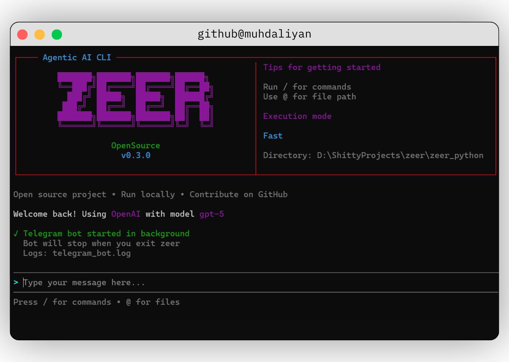

<div align="center">

<em>An agentic AI CLI that connects to multiple AI providers, featuring tool-calling, an extensible skills system, and seamless remote access from anywhere.</em>

[](https://pypi.org/project/zeer/)
[](https://pypi.org/project/zeer/)
[](https://github.com/muhdaliyan/zeer/blob/main/LICENSE)
[](https://github.com/psf/black)
[](https://pypi.org/project/zeer/)
[](https://github.com/muhdaliyan/zeer)

[](https://deepwiki.com/muhdaliyan/zeer)
[](https://www.linkedin.com/in/muhdaliyan/)
[](https://x.com/muhdaliyan_)
[](https://bsky.app/profile/muhdaliyan.bsky.social)
[](https://www.instagram.com/a1iyan__/)

</div>


<hr>

 ## ⚡ Overview
 
**Zeer** is an OpenSource agentic AI CLI that connects to multiple providers (OpenAI, Gemini, Claude, Ollama) with **tool-calling capabilities**, an **extensible skills system**, and a **clean box-style UI**.  


<p align="center">
  
</p>

---

## 🎯 Why Zeer?

Tools like Claude Code, Kiro, and Cursor are powerful but come with limitations:

* **Subscription Required** – Monthly fees for access
* **Fixed Models** – Locked into specific AI providers
* **Closed Source** – Limited customization options

**Zeer is different:**

* ✅ **Use Your Own API Keys** – Pay only for what you use, no subscriptions
* ✅ **Multi-Provider Support** – Switch between OpenAI, Gemini, Claude, Ollama, or add your own
* ✅ **Local AI Support** – Run models locally with Ollama (no API key required)
* ✅ **100% Open Source** – Customize, extend, and contribute freely
* ✅ **Extensible Skills System** – Create custom agent behaviors without code changes
* ✅ **Background Process Management** – Start and manage dev servers in the background
* ✅ **Terminal-First** – Lightweight, fast, and integrates with your workflow

> **Note:** Zeer is currently in beta. We appreciate your contributions and feedback as we continue to improve. This project will always remain open source.

---

## 🚀 Get Started

Start using Zeer quickly with the following installation options.

### **For Users (PyPI)**

```bash
pip install zeer
```

### **For Developers (Local / Editable)**

```bash
# Clone the repository
git clone https://github.com/muhdaliyan/zeer.git
cd zeer

# Install dependencies
pip install -r requirements.txt

# Install in editable mode
pip install -e .

# Run Zeer
zeer
```

> Any code changes will reflect immediately without reinstalling.

---

## 🎯 Quick Start

### CLI Mode

```bash
zeer
```

1. Select your AI provider
2. Enter your API key
3. Choose a model
4. Start chatting and using AI tools

### Telegram Bot Mode 🆕

Run your zeer assistant as a Telegram bot!

**Option 1: Quick Setup via CLI (Recommended)**
```bash
zeer
> /setup
# Select Telegram, enter bot token, start bot!
```

**Option 2: Manual Setup**
```bash
pip install python-telegram-bot python-dotenv
cp .env.example .env
# Edit .env with your tokens
python start_telegram_bot.py
```

See [SETUP_COMMAND_GUIDE.md](SETUP_COMMAND_GUIDE.md) for the `/setup` command guide, [TELEGRAM_QUICKSTART.md](TELEGRAM_QUICKSTART.md) for the 5-minute manual setup, or [TELEGRAM_SETUP.md](TELEGRAM_SETUP.md) for detailed instructions.

---

## 💻 Usage Examples

```bash
# AI automatically executes tasks
> create a PDF report about machine learning
> list all Python files in this directory
> set up a new React project structure
> read and summarize config.json

# Start dev servers in background
> start a React dev server on port 3000
> run the Flask app in the background

# Commands
/skills    # View available skills
/tools     # View available tools
/processes # View running background processes
/clear     # Clear conversation
/providers # Switch provider
/models    # Switch model
```

---

## 🤖 AI Providers

Zeer supports multiple AI providers:

### Cloud Providers (API Key Required)
* **OpenAI** – GPT-4, GPT-3.5, and more
* **Gemini** – Google's AI models (including image generation with Nano Banana)
* **Claude** – Anthropic's Claude models
* **Ollama Cloud** – Cloud-hosted Ollama models

### Local Provider (No API Key)
* **Ollama Local** – Run AI models entirely on your machine
  * No internet required
  * No API costs
  * Full privacy
  * See [OLLAMA_SETUP.md](OLLAMA_SETUP.md) for setup guide

### 🎨 Image Generation Support
Zeer supports image generation with Gemini's Nano Banana models:
* Generated images are automatically saved to `generated_images/` folder
* Images are displayed in the CLI with file path and size info
* Supports PNG, JPEG, and other formats
* See [GENERATED_IMAGES_INFO.md](GENERATED_IMAGES_INFO.md) for details

```bash
# Example: Generate an image
> can you make an image of a sports car
# Image saved to: generated_images/image_20260301_143022_1.png
```

---

## 🚀 Ollama Quick Start

Want to run AI locally without API keys?

1. Install Ollama from [ollama.ai](https://ollama.ai)
2. Pull a model: `ollama pull llama3.2`
3. Start Zeer: `zeer`
4. Select "Ollama" provider
5. Press Enter (skip API key for local)
6. Choose your model and start chatting

See [OLLAMA_SETUP.md](OLLAMA_SETUP.md) for detailed setup instructions.

---

## 🔄 Background Process Management

Zeer can start and manage development servers in the background:

```bash
# AI automatically detects and manages servers
> start a Next.js dev server
> run the Django development server
> start the Express API on port 8080

# View running processes
/processes

# AI can stop processes when needed
> stop the React dev server
```

Features:
* Automatic URL detection
* Output monitoring
* Clean process termination
* Multiple concurrent servers

---

## 🔧 Built-in Skills

* **pdf-builder** – Generate PDF documents with reportlab
* **code-helper** – Project setup & code organization
* **file-operations** – File system operations
* **text-processing** – Text manipulation & analysis
* **frontend-designer** – Frontend development assistance

---

## ✨ Creating Custom Skills

1. Create `skills/your-skill/SKILL.md`:

```markdown
---
name: your-skill
description: What this skill does and when to use it
allowed-tools: create_file read_file run_code
---

## Goal
Your skill's purpose

## Procedure
Step-by-step instructions for the AI

## Examples
Usage examples
```

2. Restart Zeer – skills are auto-discovered.

See [SKILLS_IMPLEMENTATION.md](SKILLS_IMPLEMENTATION.md) for advanced details.

---

## 🏗️ Architecture

```
zeer/
├── src/
│   ├── providers/          # AI provider implementations
│   ├── tools.py            # Tool registry & execution
│   ├── skills_manager.py   # Skills loading & validation
│   └── chat_session.py     # Context management
└── skills/                 # Modular agent skills
    ├── backend-developer/
    │   ├── SKILL.md        # Skill definition
    │   ├── scripts/        # Executable Python scripts
    |   |   └── script.py
    │   └── references/     # Additional documentation
    ├── code-helper/
    │   └── SKILL.md
    ├── file-operations/
    │   └── SKILL.md
    └── ...
```

---

## 🔄 Tool Calling Flow

1. User sends a message
2. AI decides to use tools
3. Tools execute (file ops, code, etc.)
4. Results fed back to AI
5. AI responds with final answer

---

## 📜 Skills System

* **Metadata Loading**: Only names/descriptions loaded initially
* **On-Demand Activation**: Full skill content loaded when referenced
* **Scripts Support**: Skills can include executable Python scripts
* **References**: Additional documentation files
* **Validation**: Automatic format checking on load

---

## ⚙️ Requirements

* Python 3.8+
* API key for at least one cloud provider (OpenAI, Gemini, or Claude)
* OR Ollama installed for local AI (no API key needed)

---

## 🤝 Contributing

Contributions are welcome! Follow these steps:

### Development Setup

```bash
git clone https://github.com/muhdaliyan/zeer.git
cd zeer
pip install -r requirements.txt
pip install -e .
```

### Making Changes

1. Fork the repository
2. Create a feature branch (`git checkout -b feature/amazing-feature`)
3. Make your changes
4. Test locally with `zeer`
5. Commit your changes (`git commit -m 'Add amazing feature'`)
6. Push (`git push origin feature/amazing-feature`)
7. Open a Pull Request

### Adding Custom Tools

Edit `src/tools.py` and add to the registry in `create_default_registry()`.

### Adding Custom Skills

Create a new folder in `skills/` with a `SKILL.md` following the [agentskills.io](https://agentskills.io) specification.

---

## 📜 License

MIT

---

## 🔗 Links

* [GitHub Repository](https://github.com/muhdaliyan/zeer)
* [PyPI Package](https://pypi.org/project/zeer/)
* [Agent Skills Specification](https://agentskills.io)
